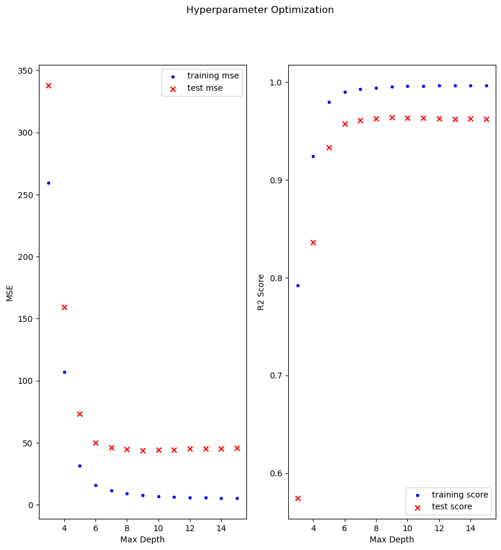

# Estimating Runtimes

I consider here the case of a financial institute issuing structured products, which correspond to multi-asset
options  on equity and precious metal underlyings with complicated payoff structures. Due to their complicated
payoff features it has become market standard to use Monte-Carlo methods for the valuation of these products.
Although, the majority of products require less than one second for a single pricing call, some products with
calculation times of 10-20 seconds can also be observed.  

Regulatory requirements force us to compute value-at-risk (VaR) numbers, which correspond to quantiles of loss
distributions at portfolio and desk level. Since the VaR numbers themselves are usually calculated using
Monte-Carlo methods as well, we would end up with a nested Monte-Carlo algorithm for the structured products,
which is clearly *not* feasible.

Therefore, we use second-order Taylor approximation schemes for the approximate valuation of these structured
products during VaR simulation. In what follows we call the calculation of all required second-order derivatives
of a single structured product the *calibration task*. Due to the large number of underlyings the calibration
tasks can take up to several hours. Limited computational resources make it necessary to optimally schedule
these calibration tasks by sorting them according to their estimated calculation time in descending order.

The exact dependency of estimated calculation times of each calibration task on the features of the structured
product is unknown. Therefore, we rely on training various decision tree models on recorded calibration time to
obtain an estimator that can be used for scheduling.

# Data

The data used to calibrate the model consists of the recorded runtimes for 9087 structured products recorded
on our productive system on 2024-05-31. In addition to the recorded calibration times the data file also contains 
the features which we assume to affect calibration time:
* `instrument_oid`: The unique (technical) object id of the structured product.
* `instrument_type`: The instrument type used to represent the structured product.
* `category`: Class variable describing the type of structured product. Eligible labels are:
  * `BRC`: Class label for barrier reverse convertibles,
  * `AC`: Class label for auto-callables,
  * `CBRC` Class label for callable barrier reverse convertibles,
  * `AccuDecu`: Class label for accumulators and decumulators.
* `num_underlyings`: The number of underlyings of the structured product.
* `expiry_date`: The date at which the structured product expires.
* `time_to_expiry`: The time between calibration and expiry date (measured in years).
* `num_paths`: The number of paths used in the Monte-Carlo simulation.
* `num_time_steps`: The number of time steps used in the Monte-Carlo simulation.
* `num_exercise_events`: The number of exercise events the structured product has.
* `calibration_date`:  The date at which runtime measurement has taken place.
* `calibration_time`: The recorded runtime for the calibration task in seconds. 

Note that only the columns labelled `category`, `num_underlyings`, `time_to_expiry`, `num_paths`, `num_exercise_events`,
and `calibration_time` are required for training - the rest of them is either obsolete or contains no useful data. 

# Model

We build a model pipeline using scikit-learn with the following components:
* `StandardScaler` from the package `sklearn.preprocessing`, and
* `RandomForestRegressor` from the package `sklearn.ensemble`.

for a detailed description see the following [page](https://scikit-learn.org/0.16/modules/generated/sklearn.ensemble.RandomForestRegressor.html#sklearn-ensemble-randomforestregressor).

The reason why we opt for a random forest model is that we can limit the maximum depth of the tree while at the
same time keeping it fairly general, which should give us a low training error while at the same time preventing
over-fitting. In addition, the random forest model allows us to carry out feature analysis, from which we can infer
which features contribute the most to calibration time, which is a big plus.

# Hyperparameter Optimisation

The random forest model contains a set of hyperparameters that can be tuned:
* `n_estimators`: The number of trees in the forest.
* `criterion`: The function to measure the quality of a split.
* `max_depth`: The maximum depth of the tree. 
* `min_samples_split`: The minimum number of samples required to split an internal node.
* `min_samples_leaf`: The minimum number of samples in newly created leaves.
* `min_weight_fraction_lead`: The minimum weighted fraction of the input samples required to be at a leaf node.
* `max_features`: The number of features to consider when looking for the best split.
* `max_leaf_nodes`: Grow trees with `max_leaf_nodes` in best-first fashion. 
* `bootstrap`: Whether bootstrap samples are used when building trees.
* `oob_score`: Whether to use out-of-bag samples to estimate the generalization error.

For the sake of brevity we limit ourselves to the case of investigating model dependency on the hyperparameters
`max_depth` and `n_estimators`.

When we plot the training and test errors vs the maximum tree depth, we see that after a value of 8 for `max_depth`
neither the mean squared error nor the R2 score do substantially improve further (here we have fixed the `n_estimators`
at 500).

Unfortunately, the case is not so clear for the hyperparameter `n_estimators` (here we have fixed `max_depth` at 6).
It seems that different values of `n_estimators` seem to have no great impact on either the mean square error or the
R2 score - both values seem to be more or less constant. 

# Results

When we fit our model with the best estimates for `max_depth` and `n_estimates` we have found, we obtain the following
metrics

* training MSE: 5.2745
* training score: 0.9943
* test MSE: 44.8724
* test score: 0.9637

Moreover, a permutation importance plot shows that the model depends mostly on the features `num_underlyings` and
`num_exercise_events`.